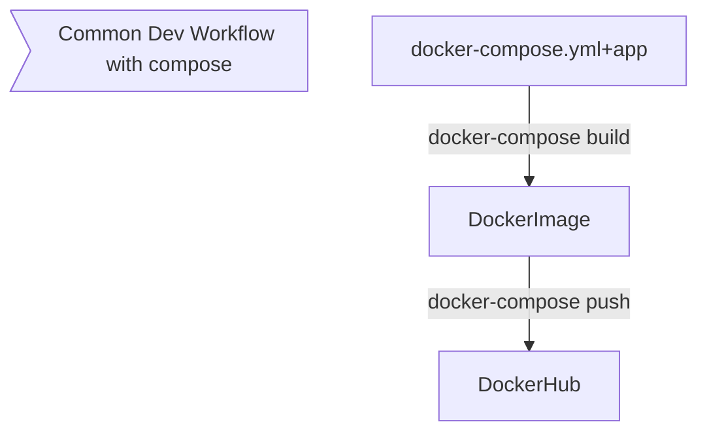

# Clonar repositorio

`git clone git@github.com:kontinu/container-bootcamps-src.git`{{execute}}


# [Docker Compose](https://docs.docker.com/compose/)


Para empezar a utilizar debe copiar el .env.example a .env

`cp .env.example .env`{{execute}}

abra el contenido del mismo

`.env`{{open}}

## Local Development - Hot Reload


`docker-compose.yml`{{open}}
`compose/docker-compose-hotreload.yml`{{open}}

Config nos permite ver como seria el yaml final

`docker-compose -f docker-compose.yml -f compose/docker-compose-hotreload.yml config`{{execute}}


Up corre los servicios
`docker-compose -f docker-compose.yml  -f compose/docker-compose-hotreload.yml up`{{execute}}

## Workflow




### Template docker-compose.yml file

```bash
docker-compose config
```

### Build
```bash
# build and up
docker-compose -f docker-compose.yml up --build
# only build
docker-compose -f docker-compose.yml build
# push it
docker-compose -f docker-compose.yml push
```

### Start
```bash
docker-compose up
```

### Check the default/created network

```bash

docker network ls

docker network inspect $(docker network ls --format "{{.Name}}" --filter name=compose)
```


### docker-compose useful commands

```bash
# running containers
docker-compose ps

# running processes in containers
docker-compose top

# logs
docker-compose logs

```

