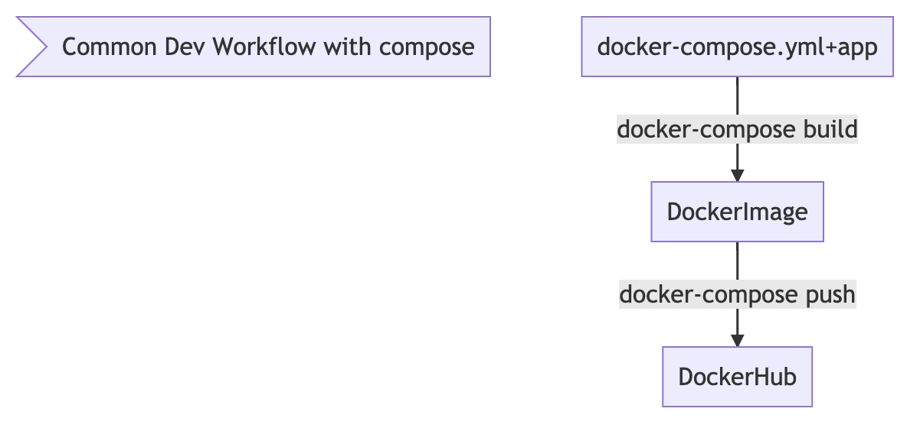

## Workflow

### Template docker-compose.yml file

`docker-compose.yml`{{open}}

`docker-compose config`{{execute}}

### Build

**build and up**

`docker-compose -f docker-compose.yml up --build`{{execute}}

*solo build*
`docker-compose -f docker-compose.yml build`{{execute}}

> cambie su .env y apunte a un repository valido.
> probablemenet necesitara de hacer docker login

*push*

`docker-compose -f docker-compose.yml push`{{execute}}

### Start

`docker-compose up -d`{{execute}}

### Check the default/created network

`docker network ls`{{execute}}

`docker network inspect $(docker network ls --format "{{.Name}}" --filter name=compose)`{{execute}}

## docker-compose useful commands

running containers

`docker-compose ps`{{execute}}

running processes in containers

`docker-compose top`{{execute}}

logs

`docker-compose logs`{{execute}}

