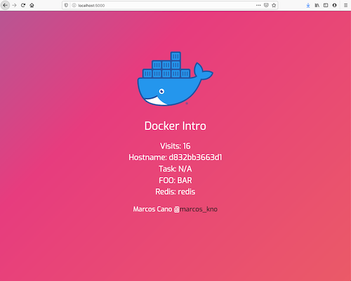
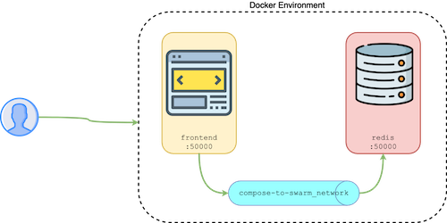

# Docker Bootcamp v1.5 - Core

Aprenderemos core-concepts, este laboratorio esta diseñado para que empieces con:

- aplicaciones multi contenedores (multi-tier)
- solo usaremos docker en modo single engine

Estas aplicaciones estan compuestas quizas por: frontend, backend, storage. por ejemplo

## Meet our app

## Architecture

> Nada fancy

